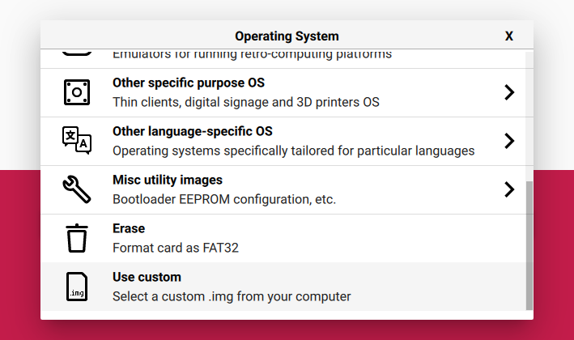
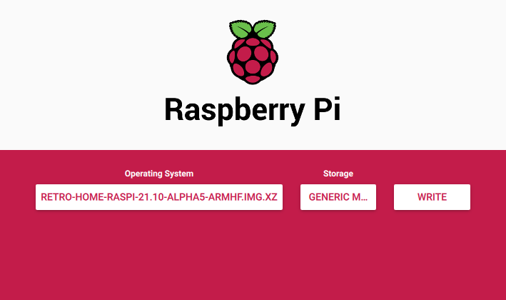

<h1 align="center">
 
  <br />
  Retro Home
</h1>

<p align="center"><b>Your Home for Retro Gaming 🕹</b></p>
<div align="center"></div>
<p align="center">Made with 💝 for </p>

## Introduction

**Retro Home is retro-gaming operating system for Raspberry Pi** and is made possible
thanks to [Ubuntu](https://ubuntu.com/raspberry-pi) and [Ludo](https://ludo.libretro.com/).

> Ludo is a minimalist frontend for emulators

  * Ask questions and provide **[feedback via our Discord](https://discord.gg/GeHJGD9)** 💬
  * Submit **[bug reports via GitHub](https://github.com/wimpysworld/retro-home/issues)** 🐛

This repository hosts downloadable images of Retro Home and the script that
builds Retro Home images for Raspberry Pi devices along with the associated
documentation to get you retro-gaming in style.

We have a Discord for this project: [](https://discord.gg/GeHJGD9)

### Features

  * Optimized images for Raspberry Pi 2, 3, 4 and 400.
  * Based on [Ubuntu](https://ubuntu.com) and [Ludo](https://ludo.libretro.com/)
  * [Supported emulation](https://jean-andre-santoni.gitbook.io/ludo/emulated-consoles):
    * Arcade
    * [Atari 2600 (VCS)](https://en.wikipedia.org/wiki/Atari_2600)
    * [Atari 5200](https://en.wikipedia.org/wiki/Atari_5200)
    * [Atari 7800](https://en.wikipedia.org/wiki/Atari_7800)
    * [Atari Jaguar](https://en.wikipedia.org/wiki/Atari_Jaguar)
    * [Atari Lynx](https://en.wikipedia.org/wiki/Atari_Lynx)
    * [Bandai Wonder Swan](https://en.wikipedia.org/wiki/WonderSwan)
    * [Bandai Wonder Swan Color](https://en.wikipedia.org/wiki/WonderSwan)
    * [Coleco Vision](https://en.wikipedia.org/wiki/ColecoVision)
    * [Magnavox Odyssey2](https://en.wikipedia.org/wiki/Magnavox_Odyssey_2)
    * Microsoft MSX
    * Microsoft MSX2
    * Nintendo Game Boy
    * Nintendo Game Boy Color
    * Nintendo Game Boy Advance
    * Nintendo DS
    * Nintendo Entertainment System
    * Super Nintendo Entertainment System
    * Nintendo 64 (*WIP*)
    * Nintendo Pokémon Mini
    * Nintendo Virtual Boy
    * [Sega Game Gear](https://en.wikipedia.org/wiki/Game_Gear)
    * [Sega Master System (Mark III)](https://en.wikipedia.org/wiki/Master_System)
      * [Sega SG-1000](https://en.wikipedia.org/wiki/SG-1000)
    * [Sega Mega Drive (Genesis)](https://en.wikipedia.org/wiki/Sega_Genesis)
      * [Sega Mega CD](https://en.wikipedia.org/wiki/Sega_CD)
      * [Sega 32X](https://en.wikipedia.org/wiki/32X)
    * [Sega Pico](https://en.wikipedia.org/wiki/Sega_Pico)
    * [Sega Saturn](https://en.wikipedia.org/wiki/Sega_Saturn)
    * [SNK Neo Geo Pocket](https://en.wikipedia.org/wiki/Neo_Geo_Pocket)
    * [SNK Neo Geo Pocket Color](https://en.wikipedia.org/wiki/Neo_Geo_Pocket_Color)
    * [NEC PC-98](https://en.wikipedia.org/wiki/PC-9800_series)
    * [NEC PC Engine TurboGrafx-16](https://en.wikipedia.org/wiki/TurboGrafx-16)
      * [NEC PC Engine TurboGrafx-CD](https://en.wikipedia.org/wiki/TurboGrafx-16#Add-ons)
    * [NEC PC Engine SuperGrafx](https://en.wikipedia.org/wiki/PC_Engine_SuperGrafx)
    * [NEC PC-FX](https://en.wikipedia.org/wiki/PC-FX)
    * [Sony PlayStation](https://en.wikipedia.org/wiki/PlayStation)
    * [Vectrex](https://en.wikipedia.org/wiki/Vectrex)
  * Supported Raspberry Pi models:
    * Raspberry Pi Compute Module 3 Lite
    * Raspberry Pi Compute Module 4 Lite
    * Raspberry Pi 2 Model B
    * Raspberry Pi 3 Model A+
    * Raspberry Pi 3 Model B
    * Raspberry Pi 3 Model B+
    * Raspberry Pi 4 Model B  (**Recommended**)
    * Raspberry Pi 400
    * Raspberry Pi Zero 2 W
  * Boot from USB
  * Automatic first boot file system expansion
  * WiFi and Bluetooth management
  * Integrated Samba and SSH server for copying over ROMS
  * [GNOME Flashback](https://wiki.gnome.org/Projects/GnomeFlashback) based micro desktop *(not on handhelds)*

## Downloads

Alpha images of Retro Home are [available for download from the GitHub releases](https://github.com/wimpysworld/retro-home/releases).

The alpha images work for most emulators and are suitable for having
retro-gaming 🕹 fun and testing to provide your [feedback to the project](https://discord.gg/GeHJGD9).

### Putting Retro Home on a Raspberry Pi

  * [Download Retro Home](https://github.com/wimpysworld/retro-home/releases)
  * Use [Raspberry Pi Imager](https://www.raspberrypi.com/software/) to put the image on microSD card.
  * Select **Use custom** from the Operating System drop down

  * Select the target microSD card.

  * Click **Write**

## Building Images

  * Clone the Retro Home project
    * `git clone https://github.com/wimpysworld/retro-home.git`

It is best to run the `retro-home-image` on an Ubuntu 22.04 x86 64-bit
workstation, ideally running in a VM via [Quickemu](https://github.com/quickemu-project/quickemu). If using a fresh [Quickemu](https://github.com/quickemu-project/quickemu) VM you will need to set the `disk_size` parameter large enough to complete the build (around 26G). This can be achieved by adding `disk_size="32G"` to `ubuntu-mate-focal.conf` before running `quickemu` to create the VM. Alternatively you could mount external storage into the container for the build area. You'll also need at least to `sudo apt install git`.

The following incantation will build a Retro Home armhf image for Raspberry Pi.

```bash
sudo ./retro-home-image --device raspi
```

You can tweak some variables towards the bottom of the `retro-home-image` script.
However, **Ludo currently only publishes pre-built binaries for `armhf`**, so
changing the target architecture is not recommended.

```bash
IMG_VER="22.04"
IMG_RELEASE="jammy"
IMG_ARCH="armhf"
```

You can also create a build without the desktop environment by setting
`SKIP_DESKTOP` to `1` in the variables near the end of the `retro-home-image`
script.

```bash
# Set to "false" to skip installing these components
INSTALL_LUDO=true
INSTALL_DESKTOP=true
```

### Usage

We will be adding hardware support for various retro themed Raspberry Pi cases
in the future.

```
Usage
  sudo ./retro-home-image --device <targetdevice>

Available supported devices are:
  raspi
  megapi
  nespi
  superpi
```

## FAQ

### How do I put ROMs on Retro Home?

ROMs are stored in `/storage/Retro/roms` on the Retro Home file system. Once
you've copied some ROMs to Retro Home (see below) you can use Ludo to
[scan your games](https://jean-andre-santoni.gitbook.io/ludo/launching-games).

If Retro Home has an active Internet connection while scanning your games, game
thumbnails will be automatically be downloaded. Thumbnails are stored
persistently and are usable without an Internet connection.

**Copying ROMs on to a Raspberry Pi via WiFi is extremely slow 🐢 We highly
recommend you use wired Ethernet for copying files over the network to Retro
Home.**

#### Windows File Sharing (Samba)

Connect to Retro Home via Windows File Sharing (Samba) and copy ROMs to the
*ROMs* folder.

#### Secure Shell (SSH)

Example:

```bash
scp *.zip ludo@retro-home-raspi.local:Retro/roms/
```

#### File copy

If you have a Linux workstation, you can insert the Retro Home
memory card / USB stick into an appropriate reader and copy ROMs to the
partition labelled `writable` in the `/storage/Retro/roms` directory.

### What is the default username and password:

This is the default username and password for logging into Retro Home via SSH
or the desktop.

  * Username: `ludo`
  * Password: `retro`

### Why is a desktop environment bundled?

Having a small desktop environment is helpful during the early stages of
development and debugging.

We will continue to include the desktop environment in most of the Retro Home
images we make available as it is useful for downloading and installing your
ROMs if you don't have another computer available.

We won't be including the desktop on Retro Home images targeting handheld
devices.

### What is included in the desktop environment?

  * Archive Manager
  * BitTorrent Client
  * File Manager
  * Ludo
  * Network Manager
  * Terminal Emulator
  * Text Editor
  * Web Browser

### How do I access the desktop?

**You must have a keyboard and mouse connected to Retro Home to access the desktop.**

  * Boot Retro Home and when Ludo has loaded pressed the Escape key.
  * Ludo will exit and you'll be presented with the display manager.
  * Select the *GNOME FlashBack* session by clicking the icon above the password entry.
  * Enter the password for the Ludo user (`retro` is the default password) and press Enter.

To shutdown or reboot Retro Home from the desktop environment, click the cog
icon in the top right of the panel.

### Capture Card Quicks

My capture cards sync at 1920x1200 @ 59.94Hz and this cause Ludo performance
to really suffer. Once Ludo is running I reset the refresh rate
as follows:

```bash
env DISPLAY=:0 xrandr --rate 60
```

### Kernel headers

If you need to build kernel modules you can install the kernel header for the
Raspberry Pi kernel like so:

```bash
sudo apt-get install linux-headers-raspi
```

## Reference

### GPIO

As of Linux kernel 5.11, the old methods of communicating with the header pins
on the Raspberry Pi will no longer work. This means that packages such as
RPi.GPIO will no longer function properly with newer kernels.

  * [The Pins They Are A-Changin’](https://waldorf.waveform.org.uk/2021/the-pins-they-are-a-changin.html)
  * [The lg archive](http://abyz.me.uk/lg/)
    * lg is an archive of programs for Linux Single Board Computers which allows control of the General Purpose Input Outputs.
  * [Raspberry Pi GPIO Tutorial](https://blogjawn.stufftoread.com/raspberry-pi-gpio-tutorial.html)
